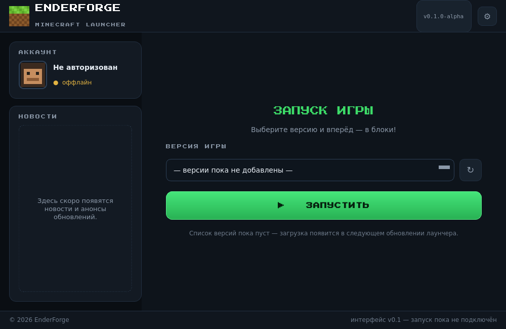

# EnderForge — Minecraft Launcher

Десктопный лаунчер Minecraft на **C++ / Qt 6 (Widgets)**.

> **Статус:** ранняя версия. Пока это только интерфейс: кнопка «Запустить»
> и выбор версии (список версий пуст — загрузка появится позже).



## Возможности (текущие)

- Тёмная тема в стиле Minecraft с пиксельным шрифтом Press Start 2P
- Логотип и аватар — собственный пиксель-арт (травяной блок, Стив)
- Карточка аккаунта («Не авторизован» — заглушка)
- Выбор версии игры (пока пусто) + кнопка обновления списка
- Кнопка «Запустить» и уведомления-«тосты»
- Скрытый режим `--screenshot <файл.png>` — для CI и проверки без дисплея

## Сборка на своей машине

Нужны: **CMake ≥ 3.16**, компилятор с C++17, **Qt 6** (пакет `qt6-base-dev`).

### Linux (Ubuntu/Debian)

```bash
sudo apt install cmake g++ qt6-base-dev
cmake -B build
cmake --build build
./build/enderforge
```

### Windows

1. Установите Qt 6 через [онлайн-инсталлятор Qt](https://www.qt.io/download-qt-installer)
   (нужен компонент *Qt → Qt Widgets*, компилятор MSVC).
2. Откройте проект в Qt Creator (откройте `CMakeLists.txt`) и соберите.

### macOS

```bash
brew install qt
cmake -B build -DCMAKE_PREFIX_PATH="$(brew --prefix qt)"
cmake --build build
./build/enderforge
```

## Сборка без системного Qt (песочница/CI)

В окружениях без Qt SDK, но с доступом к PyPI и GitHub, можно собрать так:

```bash
./scripts/build_sandbox.sh
```

Скрипт скачивает Qt 6 (библиотеки из колеса PySide6-Essentials), берёт
заголовки qtbase из GitHub, генерирует недостающие и собирает лаунчер.
Результат — `build/bin/enderforge` и скриншот `docs/preview.png`.

## Структура проекта

```
├── CMakeLists.txt            # сборка через CMake (обычная)
├── scripts/
│   ├── build_sandbox.sh      # сборка без системного Qt
│   └── gen_qt_headers.py     # генератор слоя заголовков Qt
├── src/
│   ├── main.cpp              # точка входа, шрифт, тема, режим скриншота
│   ├── MainWindow.h/.cpp     # главное окно и интерфейс
│   └── pixelart.h/.cpp       # отрисовка пиксель-арта (Стив, травяной блок)
└── resources/
    ├── theme.qss             # стили (тёмная тема в стиле Minecraft)
    └── fonts/                # Press Start 2P
```

## Планы

- [ ] Загрузка списка версий Minecraft (`version_manifest_v2.json`)
- [ ] Скачивание и запуск клиента
- [ ] Авторизация (Minecraft / Microsoft)
- [ ] Окно настроек (память, путь к игре, учётная запись)
- [ ] Список модов и сборок
