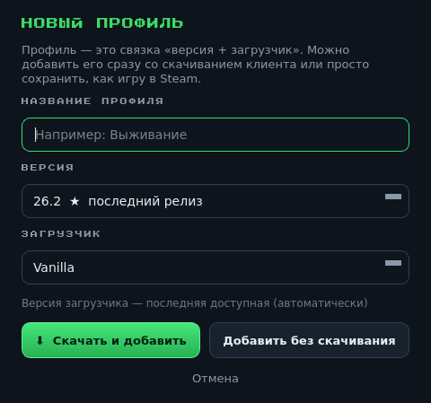

# EnderForge — Minecraft Launcher

Десктопный лаунчер Minecraft на **C++ / Qt 6 (Widgets)**.

> **Статус (v0.5.0):** ранняя версия. Профили (как игры в Steam: версия + загрузчик,
> клиент скачивается или профиль просто сохраняется), актуальный список версий
> из манифеста Mojang. **Полная установка и запуск Minecraft работают**
> (клиент, библиотеки, ресурсы, natives, загрузчик Fabric/Quilt с полным набором
> libraries и mapping'ов; авто-Java нужной версии — 8/17/21/25).


## Возможности (текущие)

- 🎮 **Профили** — как игры в Steam: название, версия, загрузчик
  (Vanilla / Fabric / Forge / NeoForge / Quilt)
- ⬇️ **«Скачать игру»** — полная установка профиля: клиент, все библиотеки
  (windows x64), нативные библиотеки, ресурсы, загрузчик Fabric/Quilt
- 🚀 **«Запустить»** — старт Minecraft (офлайн, singleplayer); если нужной Java
  нет — автоматически скачивается и распаковывается Temurin JRE нужного мажора
  (8/17/21/25 по версии Minecraft)
- 📚 **Библиотека профилей** в сайдбаре: статус цветной точкой
  (зелёный — скачан, серый — нет, красный — ошибка)
- 📦 **Актуальный список версий** из официального манифеста Mojang
  (группы: последние, релизы, снапшоты, старые беты/альфы)
- 💾 Профили хранятся в `profiles.json` (каталог данных приложения),
  клиенты — в `clients/<имя>/<версия>.jar`
- 🖥 CLI для CI: `--screenshot`, `--screenshot-dialog`, `--manifest`,
  `--list-versions`, `--download-test`, `--data-dir`



## Сборка на своей машине

Нужны: **CMake ≥ 3.16**, компилятор с C++17, **Qt 6** (пакет `qt6-base-dev`, включает Network).

### Linux (Ubuntu/Debian)

```bash
sudo apt install cmake g++ qt6-base-dev
cmake -B build
cmake --build build
./build/enderforge
```

### Windows

1. Установите Qt 6 через [онлайн-инсталлятор Qt](https://www.qt.io/download-qt-installer)
   (компоненты *Qt → Qt Widgets*, *Qt → Qt Network*, компилятор MSVC).
2. Откройте проект в Qt Creator (откройте `CMakeLists.txt`) и соберите.

### macOS

```bash
brew install qt
cmake -B build -DCMAKE_PREFIX_PATH="$(brew --prefix qt)"
cmake --build build
./build/enderforge
```

## Сборка без системного Qt (песочница/CI)

В окружениях без Qt SDK, но с доступом к PyPI и GitHub, можно собрать так:

```bash
./scripts/build_sandbox.sh
```

Скрипт скачивает Qt 6 (библиотеки из колеса PySide6-Essentials), берёт
заголовки qtbase из GitHub, генерирует недостающие, собирает лаунчер,
проверяет скачивание на локальном http-сервере и делает скриншоты
(окно + диалог) с тестовыми профилями.

## CLI-режимы

```bash
# Показать загруженные версии (источник — сеть или --manifest)
./build/enderforge --list-versions

# Офлайн-тест: список версий из локального файла манифеста
./build/enderforge --manifest version_manifest_v2.json

# Скриншот окна (для CI) — ждёт загрузки списка версий
./build/enderforge --screenshot preview.png --data-dir ./testdata

# Скриншот диалога «Добавить профиль»
./build/enderforge --screenshot-dialog dialog.png --data-dir ./testdata

# Проверка скачивания клиента (url JSON версии -> выходной jar)
./build/enderforge --download-test https://…/version.json ./client.jar

# Свой каталог данных (профили и клиенты)
./build/enderforge --data-dir ~/.enderforge
```

## Структура проекта

```
├── CMakeLists.txt            # сборка через CMake (обычная)
├── scripts/
│   ├── build_sandbox.sh      # сборка без системного Qt + тесты
│   └── gen_qt_headers.py     # генератор слоя заголовков Qt
├── src/
│   ├── main.cpp              # точка входа, CLI, шрифт, тема
│   ├── MainWindow.h/.cpp     # главное окно: профили + запуск
│   ├── ProfileStore.h/.cpp   # профили (profiles.json)
│   ├── AddProfileDialog.h/.cpp  # диалог «Добавить профиль»
│   ├── GameDownloader.h/.cpp # скачивание клиента с прогрессом
│   ├── MinecraftInstaller.h/.cpp # полная установка и запуск
│   ├── NetUtil.h             # диагностика пустых/HTML-ответов Mojang
│   ├── VersionManager.h/.cpp # загрузка/парсинг манифеста Mojang
│   ├── versionmodel.h/.cpp   # группированный список версий
│   └── pixelart.h/.cpp       # пиксель-арт (Стив, травяной блок)
└── resources/
    ├── theme.qss             # стили (тёмная тема в стиле Minecraft)
    └── fonts/                # Press Start 2P
```

## Планы

- [x] Загрузка списка версий Minecraft (манифест Mojang)
- [x] Профили: версия + загрузчик, скачать сразу или сохранить
- [x] Полная установка: клиент, библиотеки, natives, ресурсы, загрузчик
- [x] Запуск игры (офлайн) + авто-скачивание Java нужной версии (Temurin JRE 8/17/21/25)
- [ ] Forge / NeoForge
- [ ] Авторизация (Minecraft / Microsoft)
- [ ] Окно настроек (память, путь к игре, учётная запись)
